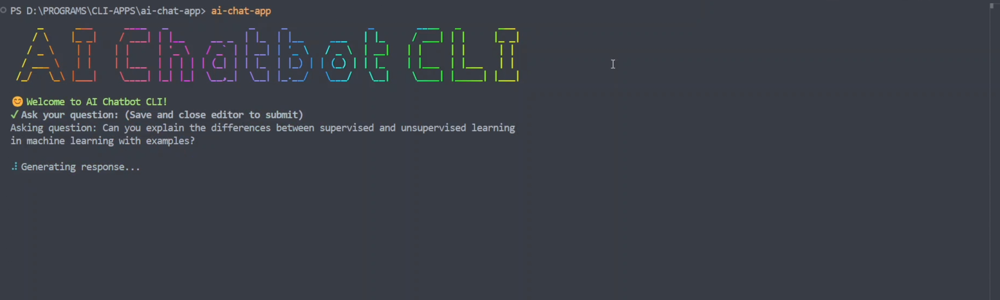

# 🧠 ShellMind - AI Chatbot CLI  

  

ShellMind is a **powerful AI chatbot** designed for **terminal users**. With **session management**, **file selection**, and a seamless **CLI experience**, it's the perfect AI assistant for developers and power users.  

🔗 **Watch the Demo Video:**  
[](https://www.youtube.com/watch?v=F_Wgxqf0kFk)  

---

## 🚀 Features  
✅ **AI-powered chatbot** in the terminal  
✅ **Session management** – Resume conversations anytime  
✅ **File selection** – Interact with files directly from CLI  
✅ **Lightweight & Fast** – Runs smoothly on any system  
✅ **Cross-platform** – Works on Windows, macOS, and Linux  

---


## 📦 Installation  
Install ShellMind globally via **npm**:  
```sh
npm i -g shellmind
```
▶️ Usage
Run the chatbot in your terminal:

#### For help
```
shellmind --h or shellmind --help
```
#### Check version
```
shellmind -V or shellmind --version
```
#### For attaching file
```
shellmind - or shellmind --file
```
#### For new session to isolate chat
```
shellmind -s or shellmind --session
```
### Build from Source
To build the project manually, use:

```
npm run build
```

## 🤝 Contributors Welcome!
**We ❤️ contributions! If you'd like to improve ShellMind, feel free to:**

**Fork** the repo
Submit a **pull request**
Report **issues** & suggest features


## 📜 License
 MIT License. Free to use, modify, and distribute.

🔗 Links
- 📽 Demo Video: [Video Link](https://youtu.be/F_Wgxqf0kFk)
- 📦 NPM Package: [ShellMind](https://www.npmjs.com/package/shellmind)

**Developed By**
Pratham Parikh - @pratham15541

